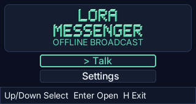
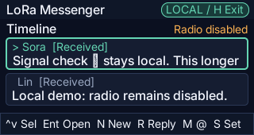
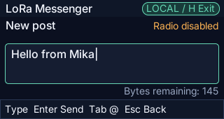
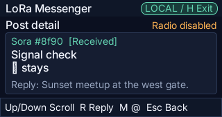
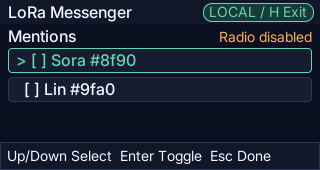
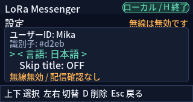

# LoRa Messenger for CardputerZero

LoRa Messenger は CardputerZero 向けの、オフライン・サーバーレスな公開ブロードキャスト型テキストメッセンジャーです。本リポジトリは Phase 6 の LoRa ソフトウェア経路と初期の Phase 8B Wi-Fi LAN プレビューを実装しています: キーボード操作の 320×170 インターフェース、クラッシュに強いローカルの識別情報・設定と有界な SQLite 履歴、バージョン管理されたバイナリプロトコル、決定的なシミュレーション多ノードテスト、Zero 互換の M5Stack Cap LoRa-1262 用オプトインの Linux ドライバ、有界かつノンブロッキングな IPv4 UDP ブロードキャストトランスポートを備えます。UI は英語・日本語・簡体字中国語（`zh-Hans`）に対応しています。

English README is available at [README.md](README.md).

## スクリーンショット

| タイトルメニュー | タイムライン | 作成 |
| --- | --- | --- |
|  |  |  |

| 投稿詳細 | メンション | 設定（日本語） |
| --- | --- | --- |
|  |  |  |

簡体字中国語 UI を含む追加のスクリーンショットは [`screenshot/`](screenshot/)（`phase2-ja-*` / `phase2-zh-hans-*` ファイル）にあります。

デスクトップシミュレータは無線を一切開きません。CardputerZero 実機では、操作者が `LORA_MESSENGER_ANTENNA_ATTACHED=1` でアンテナ装着を明示的に確認しない限り無線経路は無効のままです。デバイス、権限、無線初期化のいずれかが欠けている場合はフェイルクローズします。投稿が `Broadcast`（送信済み）になるのは、ローカルの SX1262 が全てのプライマリフラグメントの送信を受理した時だけです。これは受信側の ACK ではなく、相手への配達を保証するものでもありません。再起動後、未完了の投稿は `Unknown`（不明）になり、黙って再送されることはありません。任意のデモ用3件投稿フィクスチャは、隔離されたシミュレータテストでのみ `LORA_MESSENGER_SEED_DEMO=1` で有効化されます。
Wi-Fi LAN プレビューは別途 `LORA_MESSENGER_WIFI_BROADCAST=1` でオプトインします。既存の独自プロトコルを UDP 42425 ポートで使用し、IP メッセンジャーとのワイヤー互換性はありません。

## 現在の挙動

- `Talk` と `Settings` を備えた BattleShip 風のブランド付きメニュー画面から起動します。永続化された `Skip title` 設定を有効にすると Talk 画面から直接起動できます。既存の設定スキーマ v1 ファイルはスキップ無効の状態でスキーマ v2 へ移行します。
- 有界な新着順の Talk タイムライン、投稿詳細と返信コンテキスト、作成エディタ、観測済みピアからのメンション選択、永続化された設定、ステータス／エラー／破棄／終了／復旧／削除の各モーダルを表示します。
- 可視フォーカスとコンパクトなキーガイドによるキーボードのみのナビゲーションに対応しています。色だけに依存したインターフェースにはなっていません。
- コードポイント境界を尊重して UTF-8 を安全に編集し、メッセージ予算は 160 バイトです。
- モデルの変更をまたいでメッセージ ID を保持し、タイムラインの借用ポインタには依存しません。
- 最初の永続起動時にインストール UUID を1つ生成して保持します。ユーザー ID、送信シーケンスの高水位マーク、ロケール、履歴の正確な順序、投稿メタデータも再起動をまたいで保持されます。
- デフォルトは英語表示で、日本語または `zh-Hans` へ永続的に切り替えられます。同梱 UI グリフのカバレッジは自動テストされています。
- 現在バンドルされているフォントで未対応のユーザー入力グリフは `□` に置き換えます。
- 不正／未来日付の設定や、破損・矛盾した履歴を、データを黙って削除したり UUID をローテーションしたりせずに拒否します。復旧はデフォルトで変更なしの終了を選択し、削除には明示的な2段階目の選択が必要です。
- canonical protocol-v1 の投稿を 46〜316 バイトでエンコードし、固定 28 バイトヘッダーを持つ CRC-32 保護付き DATA フレームへフラグメント化します。再構成、受信、直近フレーム、送信待ち、再試行の各状態はいずれも固定容量と有限のタイムアウトを持ちます。
- 2,048 件分の完全 canonical ペイロード重複排除台帳を SQLite スキーマ v3 で永続化します。新規受信投稿とその重複排除レコードはアトミックにコミットされ、保持された重複や競合はローカル順序や永続化状態を変更しません。
- シード `0..9999`、MTU `48/51/64/128/255`、強制的な欠落・重複・破損・遅延・並べ替え・切断／再接続・複合障害・恒久的欠落を対象に検証します。2つの同時ヘッドレスプロセスが、有界なローカル IPC 上で canonical な投稿集合を突き合わせます。
- 決定的な入力、2回起動の再起動、破損からの復旧、スクリーンショット、ネガティブスクリプト、共通のティアダウン経路を検証します。
- Linux 上の製品ランタイムを、有界かつノンブロッキングなトランスポートおよび無線ポリシーのポート経由で Cap LoRa-1262 に接続します。受信投稿は既存のトランザクション的な永続重複排除台帳を使用し、シャットダウン時には保留中の作業をキャンセルし、無線をスリープへ戻し、Cap のアンテナスイッチを無効化します。
- 送信前に選択されたインターフェースのディレクテッドブロードキャストアドレスを再計算するオプトインの Wi-Fi LAN トランスポートを追加しています。同一サブネットからの UDP のみを受理し、ローカルな反射は無視し、切り詰めを拒否し、有界なバイトレートと最小送信間隔ポリシーを適用します。Wi-Fi のステータスは、相手への配達が未確認であることを明示し続けます。
- コア、アプリケーション、ViewModel、エディタ、ローカライゼーション、スクリプトパーシングは LVGL・SDL・ネットワーク・無線への依存を持ちません。ファイルシステム／SQLite アダプタは永続化／ランタイム層のみでリンクされ、実機用 Linux 無線アダプタは非デスクトップ Linux ビルドにのみリンクされ、シミュレーション用トランスポートはテスト専用のままです。
- systemd ユニットやバックグラウンドサービスは一切インストールしません。

## macOS でのビルドとテスト

デスクトップビルドには CMake 3.31 以上、Ninja、SDL2、FreeType、fmt、libpng、jpeg-turbo、zlib が必要です。シミュレータは configure 時にピン留めされた LVGL `v9.5.0` のソースを取得することがあります。

```sh
cmake --preset darwin-arm64 --fresh
cmake --build --preset darwin-arm64-dbg
ctest --preset darwin-arm64-dbg
cmake --build --preset darwin-arm64-rel
ctest --test-dir build/darwin-arm64 -C Release --output-on-failure
build/darwin-arm64/Debug/lora-messenger
```

## キー操作

`Home` は常に安全終了の確認を開きます。即座に終了することはありません。OS のウィンドウクローズボタンも同じ共通のリソースティアダウン経路をたどります。

| コンテキスト | キー |
| --- | --- |
| タイトルメニュー | `Up`/`Down` で `Talk` または `Settings` を選択、`Enter` で開く |
| タイムライン／Talk | `Up`/`Down` で選択、`Enter` で開く、`N` 新規、`R` 返信、`M` 選択中の送信者へメンション、`S` 設定、`Esc` でタイトルメニューへ戻る |
| 詳細 | `Up`/`Down` でスクロール、`N` 新規、`R` 返信、`M` 送信者へメンション、`S` 設定、`Esc` で戻る |
| 作成 | 印字可能文字は挿入、`Left`/`Right` で移動、`Backspace`/`Delete` で編集、`Tab` でメンションを開く、`Enter` でキュー投入、`Esc` でキャンセル／破棄 |
| メンション | `Up`/`Down` で選択、`Enter` でトグル、`Esc`/`Tab` で戻る |
| 設定 | `Up`/`Down` で言語または `Skip title` を選択、`Left`/`Right`/`Enter` で選択中の値を永続的に変更、`D` でローカルデータ削除確認を開く、`Esc` で戻る |
| モーダル | `Left`/`Right` で選択肢を変更、`Enter` で確定、`Esc` で安全側のキャンセル動作 |

`N`/`R`/`M`/`S` は入力欄以外の画面でグローバルショートカットとして機能します。作成画面とそのメンション選択は1つのアクティブなドラフト編集コンテキストを構成するため、そこでは文字キーがグローバルショートカットとして解釈されることはありません。

シミュレータは `APP_SCRIPT` を通じて任意の安全な UTF-8 を注入できます。デスクトップ版では、ホスト OS 自体の入力方式（日本語 IME や中国語 IME 等）から作成画面へ直接入力することにも対応しています。SDL のキーボードドライバは複数バイトからなる合成済み文字を1つの indev キー値へパックして渡してきますが、アプリ側でそれを正しいコードポイントへデコードしてから挿入しています（`src/platform/key_codec.h`、`src/platform/linux_input.cpp` の `key_event_cb` で配線）。実機の CardputerZero では46キーの物理キーボードに漢字・かな入力用のキーがそもそも存在しないため、日本語や中国語の任意入力の組み立ては、将来のオンデバイス IME（候補一覧＋ローマ字/ピンイン変換）に依存しており、後日の実機受け入れゲートのままです。一方、（Settings 画面などの）既存の日本語・中国語 UI 文字列を物理キーだけで入力する操作は、各キーが印字された ASCII 文字にそのまま対応しているため、既に問題なく動作します。

## オフライン・コアオンリーゲート

この経路は UI 依存の探索と `FetchContent` の前にリターンします:

```sh
cmake --preset core-only --fresh
cmake --build --preset core-only-dbg
ctest --preset core-only-dbg
cmake --build --preset core-only-rel
ctest --preset core-only-rel
```

コアオンリー経路には model／ViewModel／protocol／persistence のテストとパッケージメタデータのプリフライトが含まれます。コンパイルされるテストには Cap アダプタのシーム、日本 920MHz ポリシー、UDP トランスポートのシーム、POSIX ソケットのライフサイクル、LAN 輻輳ポリシー、2セッション無線ランタイム統合、シミュレーション用トランスポート、10,000 シードの多ノードゲート、設定 JSON、アトミックなファイルシステム操作、SQLite 履歴／マイグレーション、永続セッション統合が含まれます。この経路はオフラインのままで、LVGL/SDL の探索や FetchContent の前にリターンします。チェックは Release ビルドでも有効なままです。有界なストレス／2プロセスゲートのタイムアウトは60秒、その他のコンパイル済みテストのタイムアウトは10秒です。

AddressSanitizer と UndefinedBehaviorSanitizer には別のプリセットがあります:

```sh
cmake --preset core-only-sanitize --fresh
cmake --build --preset core-only-sanitize
ctest --preset core-only-sanitize
```

## 決定的なシミュレータ自動化

`APP_SCRIPT` は有界なカンマ区切りの入力言語です。例:

```sh
SDL_VIDEODRIVER=dummy \
XDG_CONFIG_HOME=/private/tmp/lora-readme-config \
XDG_DATA_HOME=/private/tmp/lora-readme-data \
APP_SCRIPT='EXPECT=screen:menu,ENTER,EXPECT=screen:timeline,N,TEXT=Hello%20from%20Mika,ENTER,EXPECT=modal:status,SHOT=readme-status,ENTER,HOME,RIGHT,ENTER' \
APP_SCRIPT_INTERVAL_MS=20 \
build/darwin-arm64/Debug/lora-messenger
```

対応アクションは以下の通りです:

- キー: `HOME`, `ESC`, `UP`, `DOWN`, `LEFT`, `RIGHT`, `ENTER`, `BACKSPACE`, `TAB`, `N`, `R`, `M`, `S`, `D`。
- タイミング: `WAIT` または `WAIT=1..100`。
- テキスト: `TEXT=<パーセントエンコードされた UTF-8>`、デコード後最大160バイト。予約済みバイトや非 ASCII バイトはパーセントエンコードする必要があります。
- アサーション: `EXPECT=<フィールド>:<値>` と、有界なポーリングを行う `AWAIT=<フィールド>:<値>`。フィールドは `screen`, `modal`, `locale`, `focus`, `status`, `count`, `persistence`, `newest-state` のいずれかです。
- キャプチャ: `SHOT=<正規化された小文字のステム名>` は、カレントディレクトリ直下の `screenshot/` フォルダへアトミックに PNG を書き出します。
- ライフサイクル: 末尾の `CLOSE` はデスクトップのウィンドウクローズイベントを注入します。

ソースは 16KiB、各トークンは 512 バイト、展開後は 1,024 アクションまでに制限されています。`APP_SCRIPT_INTERVAL_MS` は 20〜5000 の整数である必要があります。`APP_SCRIPT` が未設定または空の場合は自動化を無効化します。空トークンや、不明・不正・安全でない・過大・不整合・タイムアウト、あるいは末尾以外に出現した `CLOSE` は、いずれも非ゼロの終了コードとともに可視の形で失敗します。キャプチャの検証は 320×170 の PNG であることと、一時ファイルの残留がないことを確認します。

デスクトップの CTest スイートはさらに、フォントカバレッジ、想定されるスクリプト失敗ケース、フルのキーボードフロー、ウィンドウクローズ時のティアダウン、2回起動での永続化、破損からの復旧、削除確認の各フローを実行します。

## ローカルデータ・復旧・削除

設定は正規化されたバージョン付き JSON を使用し、履歴はピン留めされた SQLite 3.53.3 のアマルガメーションを WAL モードで使用します。デフォルトのパスは以下の通りです:

```text
~/.config/lora-messenger/settings.json
~/.local/share/lora-messenger/history.sqlite3
```

絶対パスの `XDG_CONFIG_HOME` と `XDG_DATA_HOME` は対応するベースディレクトリを上書きします。相対パスによる上書きは無視され、絶対パスの home が解決できない場合はカレントディレクトリへフォールバックせずに起動が失敗します。SQLite は開いている間、`history.sqlite3-wal` と `history.sqlite3-shm` を追加で作成することがあります。アプリのディレクトリと新規に書き込まれる設定はオーナーのみアクセス可能です。

設定の書き込み成功時は、同一ディレクトリ内の 0600 の一時ファイル、完全な書き込み、ファイル同期、アトミックな rename、ディレクトリ同期を使用します。履歴の変更は SQLite のトランザクション、外部キー、整合性チェック、スキーマバージョニング、256 件のタイムライン上限、2,048 件の canonical 重複排除上限を使用します。スキーマ v3 は重複排除の高水位マークと canonical な投稿バイト列を保持し、v1/v2 の履歴はトランザクション的に移行され、初期化後に黙って再シードされることはありません。作成画面は履歴トランザクションの前に、送信シーケンスを設定内に予約します。そのため、ストレージ障害は意図したシーケンス欠番を残すことがありますが、シーケンスが再利用されることはありません。

設定には明示的な履歴初期化済みマーカーが含まれます。アプリは XDG の各ツリーにオーナーのみのロックを1つずつ保持するため、設定パスまたは履歴パスのいずれかを共有するインスタンス同士が互いの完全な状態スナップショットを置き換えることはできません。既存の履歴は、正確に対応するスキーマ、インストール UUID、カウンタの不変条件、保存されている全行と照合された上で、元のデータベースが移行・WAL 化・chmod されます。全ての `sqlite_schema` 行が列挙され、想定されたテーブルとその SQLite 生成の正確な自動インデックスのみが受理されるため、隠れたトリガーや予約名を用いたスキーマインジェクションは拒否されます。検証には、プロセス中断後に WAL にのみ存在するコミット済みデータも含まれます。

その検証は、決定的でオーナーのみアクセス可能な兄弟ディレクトリ `history.sqlite3.probe/` へ、実際のデータベース成果物をステージングします。通常はプローブの一部として削除されます。強制停止によってこれが残った場合、次回起動時にデータツリーのロックを保持したまま削除されます。確認済みのローカルデータ削除も同じロックの下でこれを削除します。

未送信の下書きテキストは永続化されません。メッセージ本文が通常の診断ログに書き込まれることはありません。

パッケージのアンインストールはパッケージ化されたバイナリとアセットを削除しますが、ユーザーごとの設定と履歴は意図的に残します。それらを削除するには、Settings を開き `D` を押し、デフォルトの Cancel から Delete へ移動して確定してください。アプリは正確に対応する設定／一時／データベース／WAL／SHM／journal ファイルと、管理された検証プローブディレクトリのみを削除して終了します。起動時に破損または矛盾したデータが検出された場合、復旧モーダルも同じデフォルト安全側のルールに従います: Enter/Esc は正本ファイルを変更せずに終了し、Right の後 Enter で削除を確定します。

## アーキテクチャの境界

```text
view (LVGL)
  -> ViewModel / 永続アプリケーションセッション
    -> application + core/model + protocol
      -> commit / clock / random / datagram / radio-policy ポート
        -> atomic JSON + ピン留めされた SQLite アダプタ
        -> Linux SPI/GPIO/I2C Cap LoRa-1262 アダプタ（デバイスビルドのみ）
        -> POSIX IPv4 UDP LAN ブロードキャストアダプタ
        -> テスト専用の仮想時間シミュレーションデータグラムバス
```

`lora_messenger_core` は値オブジェクトとドメインモデルを、`lora_messenger_protocol` は canonical なエンコーディング・フレーム・フラグメント化・再構成・重複排除を、`lora_messenger_application` は同期コマンドと有界な送信スケジューラを、`lora_messenger_viewmodel` はナビゲーション・エディタ・ローカライゼーション・描画用スナップショットをそれぞれ所有します。`lora_messenger_storage` はファイルシステムと SQLite アダプタを、`lora_messenger_persistence` は起動・復旧・受信のアトミックコミット・コミット順序を所有します。`lora_messenger_cap_lora_linux` はデバイス専用の SX1262 と PI4IOE5V6408 実装を、`lora_messenger_radio_runtime` はそれを既存のスケジューラと永続セッションへ橋渡しします。`lora_messenger_lan_transport` は有界な UDP アダプタ、POSIX ソケット、LAN 輻輳ポリシーを所有します。Phase 8B の間は、明示的な Wi-Fi オプトインが LoRa の代わりにこれを選択します。同時ファンアウトは Phase 8D のままです。`lora_messenger_simulated_transport` と POSIX パイプハーネスはヘッドレステスト専用に存在します。

## プライバシーと配達に関する制限

LoRa・Wi-Fi LAN・計画中の BLE の各トランスポートは全て公開ブロードキャストです。範囲内の互換受信機であれば誰でも、暗号化されていない投稿を受信・複製・記録・偽装できます。ローカルのみの履歴は機密性を意味しません。この MVP は配達・暗号化・認証済みアイデンティティ・プライベートメッセージ・履歴同期のいずれも主張しません。

## CardputerZero 上の Wi-Fi LAN プレビュー

両端末を同一のプライベートかつクライアント分離のない Wi-Fi ネットワークへ接続し、それぞれ次のように起動します:

```sh
LORA_MESSENGER_WIFI_BROADCAST=1 \
/usr/share/APPLaunch/bin/lora-messenger-launch
```

デフォルトのインターフェースは `wlan0` です。実機の OS が異なる名前を報告する場合のみ上書きしてください:

```sh
LORA_MESSENGER_WIFI_BROADCAST=1 \
LORA_MESSENGER_WIFI_INTERFACE=wlp1s0 \
/usr/share/APPLaunch/bin/lora-messenger-launch
```

現在のプレビューは独自プロトコルによる同一サブネット UDP であり、IP メッセンジャーとの互換性はありません。物理的なチェックリストと BLE ケーパビリティゲートについては `docs/phase8-ble-wifi.md` を参照してください。

## CardputerZero 上の Cap LoRa-1262

承認済みのハードウェアは Zero 互換の M5Stack Cap LoRa-1262（SX1262、868〜923MHz）です。Cap に電源を入れる前にアンテナを取り付けてください。アプリケーションはこの物理的な確認を明示的に承認することを要求しており、それ以外の場合は無線を開きません:

```sh
LORA_MESSENGER_ANTENNA_ATTACHED=1 \
/usr/share/APPLaunch/bin/lora-messenger-launch
```

デフォルトの CardputerZero EXT マッピングは RST `GPIO26`、IRQ `GPIO23`、BUSY `GPIO22`、SCK `GPIO11`、MOSI `GPIO10`、MISO `GPIO9`、NSS/CS1 `GPIO7` です。Cap の PI4IOE5V6408 アンテナスイッチは CardputerZero の I²C `GPIO2`/`GPIO3` を使用します。Linux のデフォルトは `/dev/spidev0.1`、`/dev/gpiochip0`、`/dev/i2c-1` で、実行ユーザーはこの3つ全てへのアクセス権が必要です。デバイスノード名が異なるボードイメージでは、`LORA_MESSENGER_SPI_DEVICE`、`LORA_MESSENGER_GPIO_CHIP`、`LORA_MESSENGER_I2C_DEVICE` で上書きできます。

固定の日本プロファイルは中心周波数 920.8MHz、帯域幅 125kHz、SF9、符号化率 4/7、13dBm、12シンボルプリアンブル、プライベート同期ワード `0x12` です。アダプタは -90dBm での listen-before-talk と、60秒あたり計算エアタイム6秒・最小送信間隔100ミリ秒という追加の保守的な予算を使用します。不正なプロファイル、デバイスエラー、クロックの巻き戻り、キューのオーバーフロー、無線障害は、これらの制限を回避するのではなく送信を停止または延期します。

セットアップ手順と残りの物理的な2台受け入れチェックリストについては [docs/phase6-cap-lora-1262.md](docs/phase6-cap-lora-1262.md) を参照してください。ARM64 ビルド、パッケージ、ドライバのリンク、シミュレーションされた2セッションの挙動は検証済みです。本リポジトリのこのゲートでは、実機は一切接続されておらず、RF 送信も一切行われていません。

## CardputerZero ARM64 パッケージ

`app-builder.json` はスタンドアロン実行体を `runtime: legacy-deb-only` として宣言しています。パッケージは公式の APPLaunch ディレクトリレイアウトを使用し、メンテナスクリプトやサービスユニットを含まず、現在のメタデータスキーマに SPI/GPIO/I²C のケーパビリティキーが無いため keyboard と app-data のファイルシステム機能のみを宣言します。したがって3つの Linux デバイスノードへのアクセスは、明示的な実機受け入れゲートとなります。`.deb` には青背景の APPLaunch アイコン、4種類のランタイムフォント、SQLite のパブリックドメイン表記、完全な同梱ライセンス表記が含まれます。リポジトリの `app-builder.json` は、後日の公開ワークフロー用に、512×512 のストアアイコン、正確に4枚の 320×170 スクリーンショット、英語・日本語・簡体字中国語のストアエントリを別途提供します。

ピン留めされた SDK BSP と AArch64 ツールチェーンで Debug・Release・`.deb` をビルドできます:

```sh
cmake --preset cp0-cross --fresh
cmake --build --preset cp0-cross-dbg
cmake --build --preset cp0-cross-rel
cpack --preset cp0-cross-deb
python3 tools/package/validate_deb.py \
  --sysroot .cache/sdk_bsp-src \
  dist/lora-messenger_0.1.0-1_arm64.deb
```

パッケージバリデータは、コントロールメタデータ、アーカイブの安全性、APPLaunch レイアウト、PNG の寸法、実行体のアーキテクチャ／ローダー／依存関係、RPATH/RUNPATH の不在、ピン留めされた BSP に対する GLIBC/GLIBCXX/CXXABI 要件をチェックします。Configure と CPack もメタデータおよびパッケージチェックを必須のゲートとして実行します。

Release 成果物は、Debian trixie とその GCC 14 AArch64 クロスツールチェーン上で生成する必要があります。これにより `dpkg-shlibdeps` が正確なバージョン付きランタイム依存関係を導出します。macOS 上で生成したパッケージは、文書化された保守的な依存関係フォールバックを使用しており、ローカルの構造確認のみを目的としています。

現在の Phase 6 ソフトウェア成果物は `dist/lora-messenger_0.1.0-1_arm64.deb` です。その正確なバイトサイズと SHA-256 は、パッケージ化されたドキュメントが自身のアーカイブハッシュを再帰的に参照しないよう、ソースのみの `NOTES.md` の完了記録内に保持されています。これは ARM64 Debian trixie 環境でクリーンにインストール・検証・削除できることを確認済みです。これはクロスビルド・パッケージ・ソフトウェア無線経路の準備が整っていることのみを示すものであり、本アプリは CardputerZero 実機上で実行されておらず、物理的な無線の挙動も検証されていません。

`APP_MAINTAINER` は意図的にローカル専用の `noreply@example.invalid` プレースホルダのままです。通常のローカルパッケージ検証ではこれを警告として報告し、`--require-publishable-maintainer` はこれをエラーとして拒否します。別途承認される公開作業の前に、ユーザーは置き換え用のアイデンティティを提供・検証し、パッケージを再ビルドし、その厳格ゲートを実行する必要があります。実機テスト、ハードウェア／無線の検証、リモートへの公開、AppStore への提出も、いずれも後日の承認ゲートのままです。状態を変更する `czdev publish` コマンドは実行していません。

承認済みのロードマップは [PLAN.md](PLAN.md) を、正確な来歴・コマンド・ハッシュ・レビュー結果・未解決のハードウェアゲートは [NOTES.md](NOTES.md) を参照してください。

## ライセンス

MIT。取り込んだ CardputerZero テンプレートの著作権表示は [LICENSE](LICENSE) に保持されています。全サードパーティコンポーネントと `.deb` に含まれる内容の要約は [THIRD_PARTY_LICENSES.md](THIRD_PARTY_LICENSES.md) に、正確な来歴とハッシュを含む完全な同梱表記は [assets/licenses/THIRD_PARTY_NOTICES.md](assets/licenses/THIRD_PARTY_NOTICES.md) に、フォント固有のガイダンスは [assets/fonts/LICENSE.txt](assets/fonts/LICENSE.txt) にあります。
