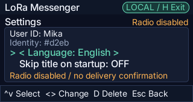

# LoRa Messenger for CardputerZero

LoRa Messenger is an offline, serverless, public-broadcast text messenger for
CardputerZero. The repository implements the Phase 6 LoRa software path and the
initial Phase 8B Wi-Fi LAN preview: a
keyboard-operated 320x170 interface, crash-safe local identity/settings and bounded
SQLite history, a versioned binary protocol, deterministic simulated multi-node
tests, an opt-in Linux driver for the Zero-compatible M5Stack Cap LoRa-1262, and a
bounded nonblocking IPv4 UDP broadcast transport. The UI is available in English,
Japanese, and Simplified Chinese (`zh-Hans`).

日本語版の README は [README.ja.md](README.ja.md) を参照してください。

## Screenshots

| Title menu | Timeline | Compose |
| --- | --- | --- |
|  |  |  |

| Post detail | Mentions | Settings |
| --- | --- | --- |
|  |  |  |

More screenshots, including the Japanese and Simplified Chinese UI, are in
[`screenshot/`](screenshot/) (see the `phase2-ja-*` and `phase2-zh-hans-*` files).

The desktop simulator never opens a radio. On CardputerZero, the radio path remains
disabled unless the operator explicitly confirms the antenna with
`LORA_MESSENGER_ANTENNA_ATTACHED=1`; missing devices, permissions, or radio
initialization fail closed. A post becomes `Broadcast` only after the local SX1262
accepts every primary fragment for transmission. This is not a receiver ACK, and
peer delivery is never claimed. After restart an unfinished post becomes `Unknown`
and is not silently retransmitted. The optional three-post demonstration fixture
is enabled only by `LORA_MESSENGER_SEED_DEMO=1` for isolated simulator tests.
The Wi-Fi LAN preview is separately opt-in with
`LORA_MESSENGER_WIFI_BROADCAST=1`. It uses the existing private protocol on UDP
42425 and is not IP Messenger wire-compatible.

## Current behavior

- Starts on a BattleShip-style branded menu with `Talk` and `Settings`. A persisted
  `Skip title` setting can launch directly into Talk; existing settings schema v1
  files migrate to schema v2 with skipping disabled.
- Shows a bounded newest-first Talk timeline, post detail and reply context,
  compose editor, observed-peer mention picker, persisted settings, and status/
  error/discard/exit/recovery/delete modals.
- Supports keyboard-only navigation with visible focus and compact key guides; the
  interface does not rely on color alone.
- Edits UTF-8 safely at code-point boundaries with a 160-byte message budget.
- Retains message IDs across model mutations instead of borrowed timeline pointers.
- Generates one installation UUID on the first durable launch and preserves it,
  the user ID, sender-sequence high-water mark, locale, exact history order, and
  post metadata across restarts.
- Displays English by default and durably switches to Japanese or `zh-Hans`.
  Bundled UI glyph coverage is tested automatically.
- Replaces unsupported user-content glyphs with `□` for the active bundled font.
- Rejects malformed/future settings or corrupt/inconsistent history without
  silently deleting data or rotating the UUID. Recovery defaults to exit without
  changes; deletion requires an explicit second choice.
- Encodes canonical protocol-v1 posts in 46 through 316 bytes and fragments them
  into CRC-32-protected DATA frames with a fixed 28-byte header. Reassembly,
  ingress, recent-frame, outbound, and retry state all have fixed capacities and
  finite timeouts.
- Persists a 2,048-record full-canonical-payload dedupe ledger in SQLite schema
  v3. A newly received post and its dedupe record commit atomically; retained
  duplicates and conflicts do not advance local order or mutate persistence.
- Exercises seeds `0..9999` over MTUs `48/51/64/128/255`, forced loss,
  duplication, corruption, delay, reordering, disconnect/reconnect, mixed faults,
  and permanent loss. Two simultaneous headless processes compare canonical post
  sets over bounded local IPC.
- Exercises deterministic input, two-launch restart, corruption recovery,
  screenshot, negative-script, and common-teardown paths.
- Connects the Linux product runtime to the Cap LoRa-1262 through bounded,
  non-blocking transport and radio-policy ports. Received posts use the existing
  transactional persistent dedupe ledger; shutdown cancels pending work, returns
  the radio to sleep, and disables the Cap antenna switch.
- Adds an opt-in Wi-Fi LAN transport that recomputes the selected interface's
  directed broadcast address before send, accepts only same-subnet UDP sources,
  ignores local reflection, rejects truncation, and applies a bounded byte-rate
  and minimum-gap policy. Wi-Fi status remains explicit that peer delivery is
  unconfirmed.
- Keeps core, application, ViewModel, editor, localization, and script parsing free
  of LVGL, SDL, network, and radio dependencies. Filesystem/SQLite adapters are
  linked only by the persistence/runtime layer; the real Linux radio adapter is
  linked only into non-desktop Linux builds, and the simulated transport remains
  test-only.
- Installs no systemd unit or background service.

## macOS build and test

The desktop build requires CMake 3.31+, Ninja, SDL2, FreeType, fmt, libpng,
jpeg-turbo, and zlib. The simulator may fetch the pinned LVGL `v9.5.0` source during
configure.

```sh
cmake --preset darwin-arm64 --fresh
cmake --build --preset darwin-arm64-dbg
ctest --preset darwin-arm64-dbg
cmake --build --preset darwin-arm64-rel
ctest --test-dir build/darwin-arm64 -C Release --output-on-failure
build/darwin-arm64/Debug/lora-messenger
```

## Keyboard controls

`Home` always opens the safe-exit confirmation. It never exits immediately. The OS
window close button follows the same common resource-teardown path.

| Context | Keys |
| --- | --- |
| Title menu | `Up`/`Down` selects `Talk` or `Settings`; `Enter` opens |
| Timeline / Talk | `Up`/`Down` select, `Enter` opens, `N` new, `R` reply, `M` mention selected sender, `S` settings, `Esc` returns to the title menu |
| Detail | `Up`/`Down` scroll, `N` new, `R` reply, `M` mention sender, `S` settings, `Esc` returns |
| Compose | printable text inserts, `Left`/`Right` moves, `Backspace`/`Delete` edits, `Tab` opens mentions, `Enter` queues, `Esc` cancels/discards |
| Mentions | `Up`/`Down` select, `Enter` toggles, `Esc`/`Tab` returns |
| Settings | `Up`/`Down` selects language or `Skip title`; `Left`/`Right`/`Enter` changes the selected value durably; `D` opens delete-local-data confirmation; `Esc` returns |
| Modal | `Left`/`Right` changes the choice, `Enter` confirms, `Esc` takes the safe cancel action |

`N`/`R`/`M`/`S` are global on non-entry screens. Compose and its mention picker
form one active draft-editing context, so letter keys are never interpreted as
global shortcuts there.

The simulator can inject arbitrary safe UTF-8 through `APP_SCRIPT`, and typing
through the host OS's own input method (e.g. a native Japanese or Chinese IME)
into the desktop build's Compose screen is fully supported: the SDL keyboard
driver delivers composed multi-byte characters packed into a single indev key
value, and the app decodes that back into the real codepoint before inserting
it (`src/platform/key_codec.h`, wired in `src/platform/linux_input.cpp`'s
`key_event_cb`). On a physical CardputerZero, the 46-key hardware keyboard has
no CJK keys at all, so arbitrary Japanese or Chinese composition there depends
on a future on-device IME (candidate list plus romaji/pinyin conversion) and
remains a later device acceptance gate; typing an existing Japanese/Chinese UI
string with the physical keys (e.g. from Settings) already works today, since
those keys map straight to their printed ASCII/available characters.

## Offline core-only gate

This route returns before UI dependency discovery and `FetchContent`:

```sh
cmake --preset core-only --fresh
cmake --build --preset core-only-dbg
ctest --preset core-only-dbg
cmake --build --preset core-only-rel
ctest --preset core-only-rel
```

The core-only route includes model/ViewModel/protocol and persistence tests plus
the package-metadata preflight. The compiled tests include the Cap adapter seam,
Japan 920 MHz policy, UDP transport seam, POSIX socket lifecycle, LAN congestion
policy, two-session radio runtime integration, simulated transport, the
10,000-seed multi-node gate, settings JSON, atomic filesystem, SQLite history/
migration, and persistent-session integration. This route remains offline and
returns before LVGL/SDL discovery or
FetchContent. Checks remain active in Release builds. The bounded
stress/two-process gate has a 60-second timeout; the other compiled tests have
ten-second timeouts.

AddressSanitizer and UndefinedBehaviorSanitizer have a separate preset:

```sh
cmake --preset core-only-sanitize --fresh
cmake --build --preset core-only-sanitize
ctest --preset core-only-sanitize
```

## Deterministic simulator automation

`APP_SCRIPT` is a bounded, comma-separated input language. For example:

```sh
SDL_VIDEODRIVER=dummy \
XDG_CONFIG_HOME=/private/tmp/lora-readme-config \
XDG_DATA_HOME=/private/tmp/lora-readme-data \
APP_SCRIPT='EXPECT=screen:menu,ENTER,EXPECT=screen:timeline,N,TEXT=Hello%20from%20Mika,ENTER,EXPECT=modal:status,SHOT=readme-status,ENTER,HOME,RIGHT,ENTER' \
APP_SCRIPT_INTERVAL_MS=20 \
build/darwin-arm64/Debug/lora-messenger
```

Supported actions are:

- Keys: `HOME`, `ESC`, `UP`, `DOWN`, `LEFT`, `RIGHT`, `ENTER`, `BACKSPACE`,
  `TAB`, `N`, `R`, `M`, `S`, and `D`.
- Timing: `WAIT` or `WAIT=1..100`.
- Text: `TEXT=<percent-encoded UTF-8>` with at most 160 decoded bytes. Reserved or
  non-ASCII bytes must be percent-encoded.
- Assertions: `EXPECT=<field>:<value>` and bounded polling
  `AWAIT=<field>:<value>`, where the field is `screen`, `modal`, `locale`, `focus`,
  `status`, `count`, `persistence`, or `newest-state`.
- Capture: `SHOT=<canonical-lowercase-stem>` writes an atomic PNG below the current
  working directory's `screenshot/` folder.
- Lifecycle: terminal `CLOSE` injects a desktop window-close event.

The source is limited to 16 KiB, each token to 512 bytes, and expansion to 1,024
actions. `APP_SCRIPT_INTERVAL_MS` must be an integer from 20 through 5000. Unset or
empty `APP_SCRIPT` disables automation. Empty tokens and unknown, malformed, unsafe,
oversized, mismatched, timed-out, or non-terminal `CLOSE` sequences fail visibly
with a non-zero status. Capture verification checks a 320x170 PNG and absence of
temporary residue.

The desktop CTest suite additionally runs font coverage, expected script-failure cases,
the full keyboard flow, window-close teardown, two-launch persistence, corruption
recovery, and delete-confirmation flows.

## Local data, recovery, and removal

Settings use canonical versioned JSON and history uses the pinned SQLite 3.53.3
amalgamation in WAL mode. Default paths are:

```text
~/.config/lora-messenger/settings.json
~/.local/share/lora-messenger/history.sqlite3
```

Absolute `XDG_CONFIG_HOME` and `XDG_DATA_HOME` override the corresponding base
directories. Relative overrides are ignored; startup fails rather than falling
back to the current directory when no absolute home can be resolved. SQLite may
also create `history.sqlite3-wal` and `history.sqlite3-shm` while open. The app's
directories and newly written settings are owner-only.

Successful settings writes use a same-directory 0600 temporary file, complete
write, file sync, atomic rename, and directory sync. History mutations use SQLite
transactions, foreign keys, integrity checks, schema versioning, a 256-entry
timeline bound, and a 2,048-entry canonical dedupe bound. Schema v3 stores the
dedupe high-water mark and canonical post bytes; v1/v2 histories migrate
transactionally and are never silently reseeded after initialization. Compose
reserves its sender sequence in settings before the history transaction. A
storage failure may therefore leave an intentional sequence gap, but a sequence
is never reused.

Settings contain an explicit history-initialized marker. The app also holds one
owner-only lock in each XDG tree, so instances that share either the settings path
or the history path cannot replace one another's full-state snapshot. Existing
history is checked against the exact supported schema, installation UUID, counter
invariants, and every stored row before the original database is migrated, changed
to WAL, or chmodded. Every `sqlite_schema` row is enumerated: only the expected
tables and their exact SQLite-created autoindexes are accepted, so hidden triggers
and reserved-name schema injections are rejected. Validation includes committed
data still present only in a WAL after an interrupted process.

That validation stages the exact database artifacts in the deterministic,
owner-only sibling directory `history.sqlite3.probe/`. It is normally removed as
part of the probe. If a forced stop leaves it behind, the next startup removes it
while holding the data-tree lock; confirmed local-data deletion checks and removes
it under the same lock as well.

The empty `settings.lock` and `history.lock` coordination leaves may remain in the
two app directories; they contain no identity, settings, or message data. They are
kept while the process exits or deletes data so a second instance cannot enter a
partially completed operation.

Draft text that has not been submitted is not persisted. No message body is written
to normal diagnostics.

Package uninstall removes packaged binaries and assets but intentionally leaves
per-user settings and history. To remove them, open Settings, press `D`, move from
the default Cancel choice to Delete, and confirm. The app deletes only its exact
settings/temp/database/WAL/SHM/journal files, plus the managed validation-probe
directory, and exits. If startup detects corrupt or inconsistent data, the recovery
modal follows the same default-safe rule: Enter/Esc exits without modifying the
authoritative files; Right then Enter confirms deletion.

## Architecture boundary

```text
view (LVGL)
  -> ViewModel / persistent application session
    -> application + core/model + protocol
      -> commit / clock / random / datagram / radio-policy ports
        -> atomic JSON + pinned SQLite adapters
        -> Linux SPI/GPIO/I2C Cap LoRa-1262 adapter (device build only)
        -> POSIX IPv4 UDP LAN broadcast adapter
        -> test-only virtual-time simulated datagram bus
```

`lora_messenger_core` owns value objects and domain models;
`lora_messenger_protocol` owns canonical encoding, frames, fragmentation,
reassembly, and dedupe; `lora_messenger_application` owns synchronous commands and
the bounded outbound scheduler; and
`lora_messenger_viewmodel` owns navigation, editor, localization, and render-ready
snapshots. `lora_messenger_storage` owns filesystem and SQLite adapters, while
`lora_messenger_persistence` owns startup, recovery, atomic receive commit, and
commit ordering. `lora_messenger_cap_lora_linux` owns the device-only SX1262 and
PI4IOE5V6408 implementation, while `lora_messenger_radio_runtime` bridges it to the
existing scheduler and persistent session. `lora_messenger_lan_transport` owns the
bounded UDP adapter, POSIX socket, and LAN congestion policy. During Phase 8B the
explicit Wi-Fi opt-in selects it in place of LoRa; concurrent fan-out remains
Phase 8D. `lora_messenger_simulated_transport` and the POSIX pipe harness exist
only for headless tests.

## Privacy and delivery limitations

The LoRa, Wi-Fi LAN, and planned BLE transports are public broadcasts. Any compatible receiver
in range may receive, copy, record, or spoof unencrypted posts. Local-only history
is not confidentiality. The MVP does not claim delivery, encryption, authenticated
identity, private messages, or history synchronization.

## Wi-Fi LAN preview on CardputerZero

Connect both devices to the same private, non-client-isolated Wi-Fi network and
launch each with:

```sh
LORA_MESSENGER_WIFI_BROADCAST=1 \
/usr/share/APPLaunch/bin/lora-messenger-launch
```

The default interface is `wlan0`. Override it only when the physical OS reports a
different name:

```sh
LORA_MESSENGER_WIFI_BROADCAST=1 \
LORA_MESSENGER_WIFI_INTERFACE=wlp1s0 \
/usr/share/APPLaunch/bin/lora-messenger-launch
```

The current preview is private-protocol same-subnet UDP, not IP Messenger
compatibility. See `docs/phase8-ble-wifi.md` for its physical checklist and BLE
capability gate.

## Cap LoRa-1262 on CardputerZero

The approved hardware is the Zero-compatible M5Stack Cap LoRa-1262 (SX1262,
868–923 MHz). Install its antenna before powering the Cap. The application requires
that physical check to be acknowledged explicitly and otherwise does not open the
radio:

```sh
LORA_MESSENGER_ANTENNA_ATTACHED=1 \
/usr/share/APPLaunch/bin/lora-messenger-launch
```

The default CardputerZero EXT mapping is RST `GPIO26`, IRQ `GPIO23`, BUSY
`GPIO22`, SCK `GPIO11`, MOSI `GPIO10`, MISO `GPIO9`, and NSS/CS1 `GPIO7`.
The Cap's PI4IOE5V6408 antenna switch uses CardputerZero I²C `GPIO2`/`GPIO3`.
Linux defaults are `/dev/spidev0.1`, `/dev/gpiochip0`, and `/dev/i2c-1`;
the launching user must have access to all three. Board images that expose
different device-node names may override them with
`LORA_MESSENGER_SPI_DEVICE`, `LORA_MESSENGER_GPIO_CHIP`, and
`LORA_MESSENGER_I2C_DEVICE`.

The fixed Japan profile is 920.8 MHz center frequency, 125 kHz bandwidth, SF9,
coding rate 4/7, 13 dBm, 12-symbol preamble, and private sync word `0x12`. The
adapter uses listen-before-talk at -90 dBm and an additional conservative
calculated-airtime budget of 6 seconds per 60 seconds with a 100 ms minimum gap.
Invalid profiles, device errors, clock rollback, queue overflow, or radio faults
stop or defer transmission instead of bypassing these bounds.

See [docs/phase6-cap-lora-1262.md](docs/phase6-cap-lora-1262.md) for setup and the
remaining physical two-device acceptance checklist. The ARM64 build, package,
driver linking, and simulated two-session behavior are validated; no physical
device was connected and no RF transmission was performed in this repository
gate.

## CardputerZero ARM64 package

`app-builder.json` declares the standalone executable as
`runtime: legacy-deb-only`. The package uses the official APPLaunch directory
layout, contains no maintainer scripts or service unit, and declares only keyboard
and app-data filesystem capabilities because the current metadata schema has no
SPI/GPIO/I²C capability keys. Access to the three Linux device nodes is therefore
an explicit physical-device acceptance gate. The `.deb` includes the
blue-background APPLaunch icons, four runtime fonts, the SQLite public-domain
notice, and complete bundled license notices. The repository's `app-builder.json`
separately supplies the 512x512 store icon, four exact 320x170 screenshots, and
English, Japanese, and Simplified Chinese store entries for a later publication
workflow.

The pinned SDK BSP and AArch64 toolchain can build Debug, Release, and the `.deb`:

```sh
cmake --preset cp0-cross --fresh
cmake --build --preset cp0-cross-dbg
cmake --build --preset cp0-cross-rel
cpack --preset cp0-cross-deb
python3 tools/package/validate_deb.py \
  --sysroot .cache/sdk_bsp-src \
  dist/lora-messenger_0.1.0-1_arm64.deb
```

The package validator checks control metadata, archive safety, the APPLaunch
layout, PNG dimensions, executable architecture/loader/dependencies, absence of
RPATH/RUNPATH, and GLIBC/GLIBCXX/CXXABI requirements against the pinned BSP.
Configure and CPack also run the metadata and package checks as mandatory gates.

Release artifacts must be generated on Debian trixie with its GCC 14 AArch64
cross-toolchain so `dpkg-shlibdeps` derives the exact versioned runtime
dependencies. A package generated on macOS uses the documented conservative
dependency fallback and is for local structure inspection only.

The current Phase 6 software artifact is
`dist/lora-messenger_0.1.0-1_arm64.deb`; its exact byte size and SHA-256 are kept
in the source-only `NOTES.md` completion record so packaged documentation does not
refer recursively to its own archive hash. It installed, verified, and removed
cleanly in an ARM64 Debian trixie environment. This establishes cross-build,
package, and software-radio-path readiness only: the app has not been run on
CardputerZero, and physical radio behavior has not been validated.

`APP_MAINTAINER` intentionally remains the local-only
`noreply@example.invalid` placeholder. Normal local package validation reports it
as a warning; `--require-publishable-maintainer` rejects it as an error. Before any
separately approved publication, the user must provide and verify the replacement
identity, rebuild the package, and run that strict gate. Physical-device testing,
hardware/radio validation, remote publication, and AppStore submission also remain
later approval gates. The mutating `czdev publish` command was not invoked.

See [PLAN.md](PLAN.md) for the approved roadmap and [NOTES.md](NOTES.md) for exact
provenance, commands, hashes, review results, and unresolved hardware gates.

## License

MIT. The imported CardputerZero Template attribution is preserved in
[LICENSE](LICENSE). [THIRD_PARTY_LICENSES.md](THIRD_PARTY_LICENSES.md) summarizes
every third-party component and what ships in the `.deb`; the complete bundled
notices with exact provenance and hashes are in
[assets/licenses/THIRD_PARTY_NOTICES.md](assets/licenses/THIRD_PARTY_NOTICES.md),
with font-specific guidance in [assets/fonts/LICENSE.txt](assets/fonts/LICENSE.txt).
